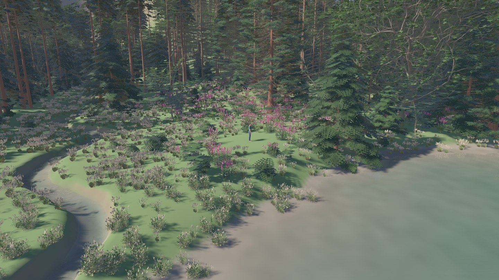
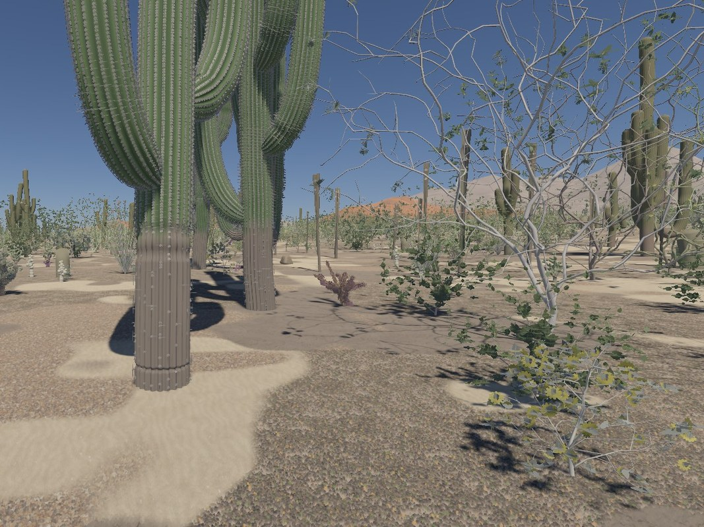
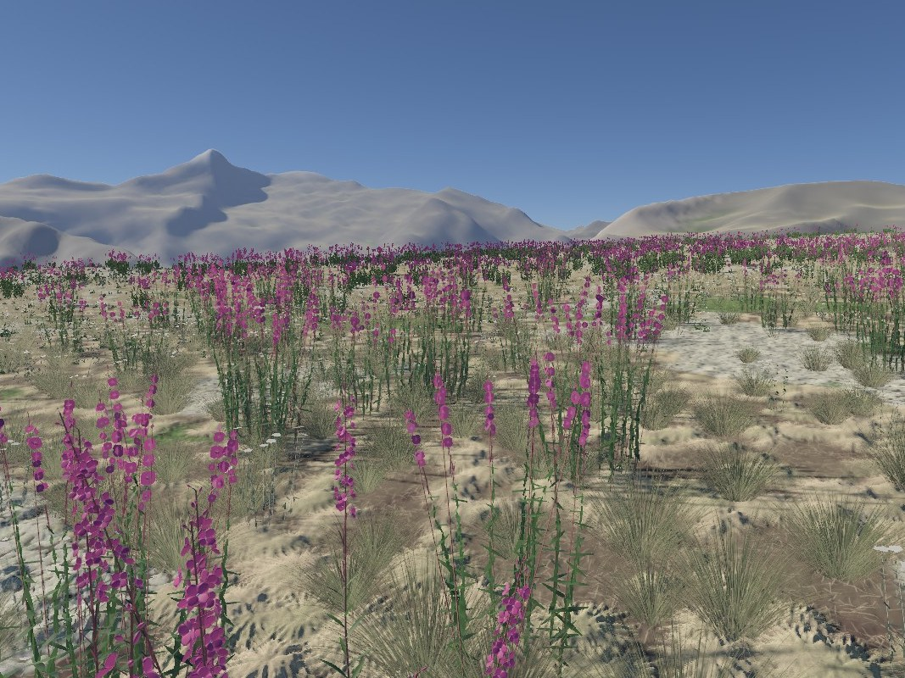
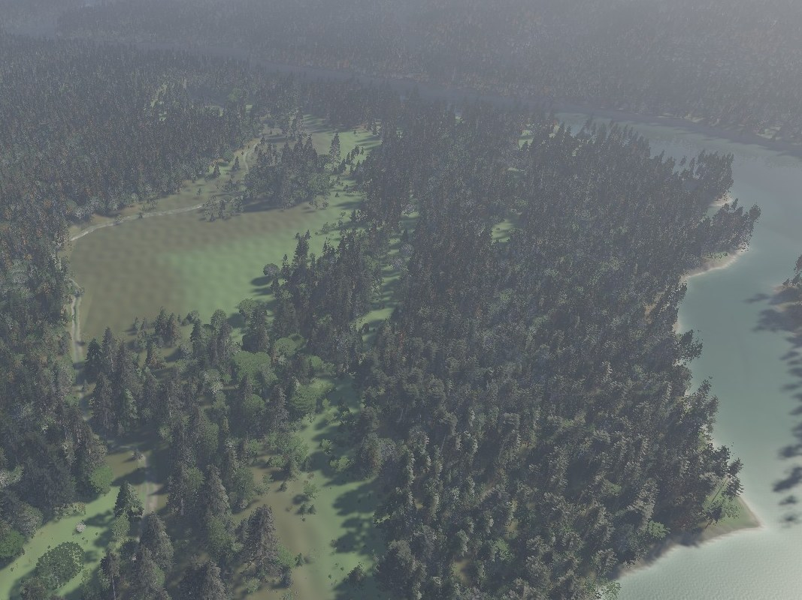
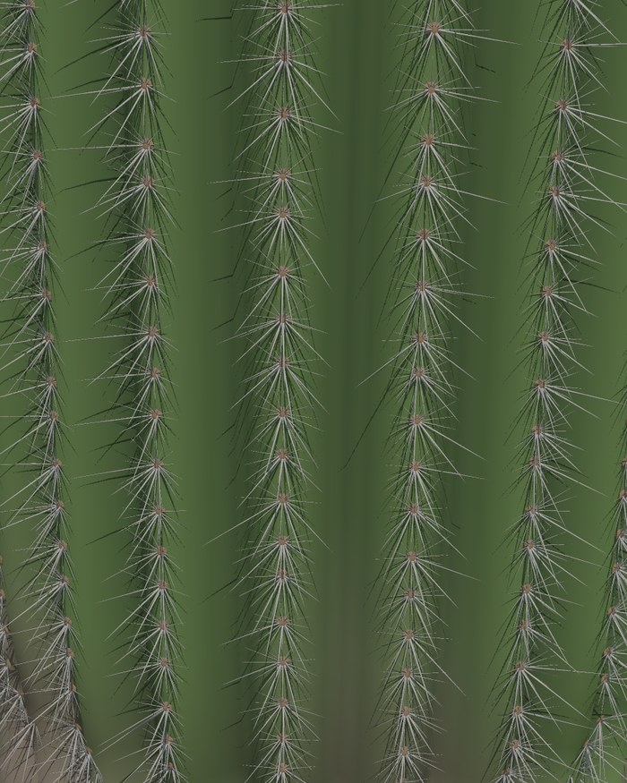
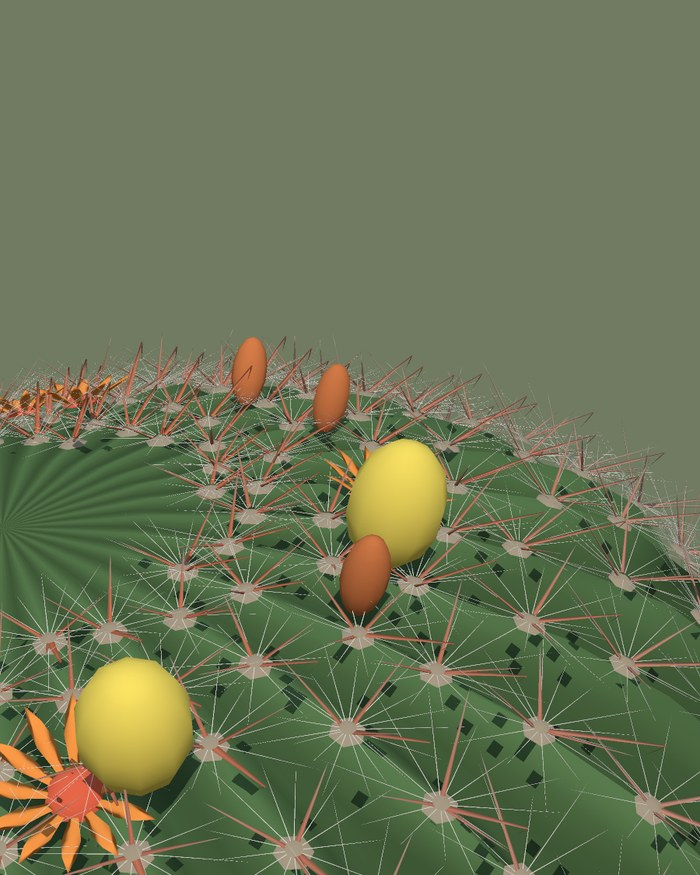
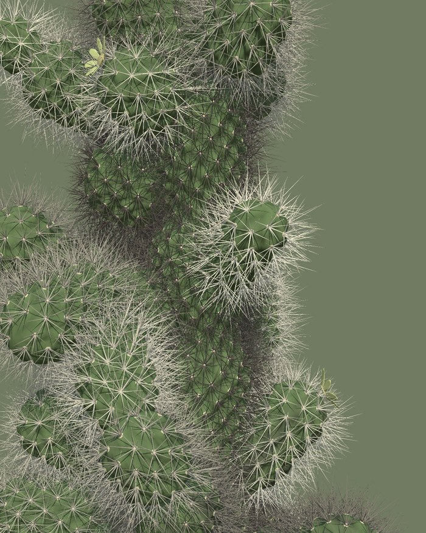

# PlantGen

Botanically accurate generation of 3D plant models from open data.

**Website: [plantgen.io](https://plantgen.io)**



*PlantGen's species in a forest of the Pacific Northwest, placed by habitat
and rendered in real time.*

PlantGen grows plants the way plants grow. A species is data: its form,
its looks and where it lives, each value with a note on how it is known.
A plant program written in an open L-system language says how the species
branches, leafs, flowers and fruits. The compiler grows each plant from
seed to old age, reading the light, the space and the neighbours around
it, and turns what grew into meshes, levels of detail and impostors. No
3D models are stored or shipped: you grow them on your own machine, and the
same species and seed give the same plant, bit for bit, on every machine.

| | | |
| --- | --- | --- |
|  |  |  |
| *A Sonoran Desert bajada: saguaros among shrubs and smaller cacti.* | *Fireweed in flower across a subalpine meadow in the Cascades.* | *The Hoh River from the air: rainforest conifers down to the water.* |

*Rendered in real time, with each species placed where its habitat fits.*

| | | |
| --- | --- | --- |
|  |  |  |
| *Saguaro: every areole along every rib grows its own spines, which shade the stem.* | *Fishhook barrel cactus: hooked central spines, flowers and fruit on the crown.* | *Teddy-bear cholla: joints packed with pale spines.* |

*Close-ups rendered by `plantc render --focus` from the built-in library,
with every flower, fruit and spine drawn as its own mesh (`--parts on`).*

## What it does

- **Species as data.** 152 built-in species in 62 families: trees, shrubs,
  ferns, grasses, herbs, cacti and other succulents, palms, climbers and
  epiphytes. Each lives in its own folder, filed by family and genus
  (`crates/plantgen/library/<family>/<genus>/<species>/`). There it has a
  `spec.json` for its form and looks and a `conditions.json` for the site
  it typically grows on. Where it has been written, a `niche.json` says
  where it grows and a `shed.json` what falls from it.
- **Plant programs.** 14 programs in PlantGen's open L-system language
  (`crates/plantgen/programs/*.lsys`), from conifers and broadleaf trees to
  grasses, ferns, cacti and climbers. Versioned environment tools let a
  growing tip ask about light, space, vigour and its host.
- **Growth.** Plants are grown, not modelled. Light and crowding shape the
  crown, branches thicken by the pipe model, organs come and go with the
  seasons, and wood is shed as the tree ages.
- **Output.** Meshes at four levels of detail and impostors for the
  distance. They come with organ card textures drawn from each species'
  looks, solid spines and part meshes for flowers, fruit and cones. All of
  it goes into a content-addressed package whose key hashes the spec, the
  program and the generator's revision.
- **Ground.** Tiling textures of what plants lay on the ground: needles,
  leaves, thatch, twigs, mosses and grasses, and each canopy species' own
  litter.
- **Deterministic and offline.** The generator depends only on `libm`,
  `png`, `serde`, `serde_json` and `sha2`. Nothing it runs uses the
  network, another process or AI.

## Getting started

You need a Rust toolchain; `rust-toolchain.toml` pins the version.

```bash
cargo build --release
./target/release/plantc list
./target/release/plantc render carnegiea-gigantea --out saguaro.png --view three-quarter --parts on
./target/release/plantc lineup pseudotsuga-menziesii acer-macrophyllum --out lineup.png
./target/release/plantc build carnegiea-gigantea --out plants
```

`plantc help` lists every command: growing a plant and printing its size
at every age, rendering it at one age or every age, its organs through the
year, its card textures and the ground's looks, and building packages.
`--library DIR` reads species and programs from a folder on top of the
built-in ones, so you can write your own.

## Contributing

PlantGen is developed by its owner. Issues, pull requests and comments
from others are not read or merged, so please don't open them. That keeps
the project's AI tooling safe from prompt injection. You are welcome to
fork it under the licence below.

## License

PlantGen's own code is released under the [MIT License](LICENSE.md). Data
sources keep their own licenses.
